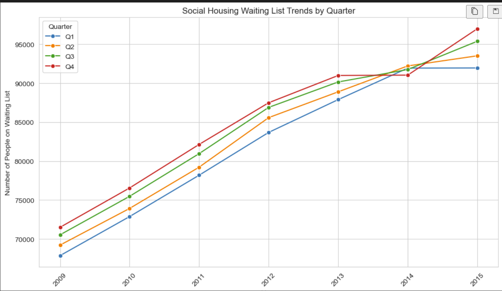
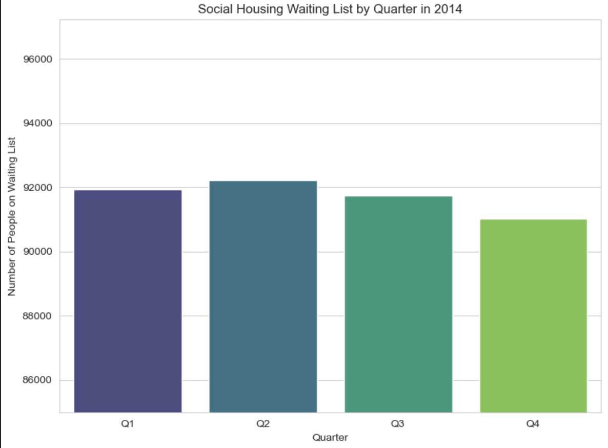

# Data Visualization

## Assignment 4: Final Project

### Requirements:
- We will finish this class by giving you the chance to use what you have learned in a practical context, by creating data visualizations from raw data. 
- Choose a dataset of interest from the [City of Toronto’s Open Data Portal](https://www.toronto.ca/city-government/data-research-maps/open-data/) or [Ontario’s Open Data Catalogue](https://data.ontario.ca/). 
- Using Python and one other data visualization software (Excel or free alternative, Tableau Public, any other tool you prefer), create two distinct visualizations from your dataset of choice.  

- For each visualization, describe and justify: 
    > What software did you use to create your data visualization?

    For this data visualization, I used Python with the Seaborn and Matplotlib libraries.

    > Who is your intended audience? 

     The intended audience for this visualization includes policymakers, urban planners, and social service organizations interested in understanding the trends in social housing demand in Toronto. Additionally, it can be useful for researchers and analysts studying housing issues or socioeconomic trends.

    > What information or message are you trying to convey with your visualization? 

    The visualization aims to convey the trends and variations in the social housing waiting list numbers across different years and then quarters of 2014. By presenting this data, the visualization highlights periods of increased demand, allowing stakeholders to make informed decisions regarding resource allocation and policy interventions.
    
    > What design principles (substantive, perceptual, aesthetic) did you consider when making your visualization? How did you apply these principles? With what elements of your plots? 

    Substantive:

    Relevance of Data: Only data relevant to the specific years (2014) and quarters were included to provide a focused analysis.
    
    Perceptual:

    Clarity: Used clear labels, titles, and legends to ensure that the visualization is easy to understand at a glance.
    Contrast: Applied contrasting colors to distinguish between different quarters effectively.

    Aesthetic:

    Color Palette: Chose a visually pleasing color palette (viridis) that is also colorblind-friendly to enhance accessibility.

    Layout: Organized the chart with balanced spacing and alignment to make it visually appealing.
    
    > How did you ensure that your data visualizations are reproducible? If the tool you used to make your data visualization is not reproducible, how will this impact your data visualization? 

    Ensuring Reproducibility:

    Code Sharing: The Python code used to generate the visualization can be shared and run on any system with the necessary libraries installed, ensuring that others can reproduce the results.
    Data Documentation: Provided clear steps for data loading, cleaning, and transformation, which are essential for reproducing the visualization.
    Impact of Non-Reproducible Tools:

    If a non-reproducible tool were used, it could limit the ability of others to verify or extend the analysis, potentially affecting the credibility and utility of the visualization.

    
    > How did you ensure that your data visualization is accessible?  

    Color Choice: Used a colorblind-friendly palette to accommodate users with visual impairments.
    Font and Labeling: Ensured that fonts and labels are legible and appropriately sized.
    Layout: Applied a simple layout to avoid overwhelming users with too much information.
    
    > Who are the individuals and communities who might be impacted by your visualization?  

    Impacted Individuals and Communities:

    Social Housing Applicants: Individuals on the waiting list may be directly impacted by policies informed by this analysis.
    Policy Makers and Planners: The visualization can assist in decision-making that affects funding and resource allocation.
    Community Organizations: Groups advocating for affordable housing may use the data to support their initiatives.
    
    > How did you choose which features of your chosen dataset to include or exclude from your visualization? 

    Included Features: Focused on the waiting list numbers for each quarter within 2014 to provide a detailed analysis of trends during that year.
    Excluded Features: Data from other years and unrelated variables were excluded to maintain focus on the specific analysis required.
    
    > What ‘underwater labour’ contributed to your final data visualization product?

    Data Cleaning: Significant effort was put into cleaning and preparing the data, including handling missing values and converting data types.
    Error Handling: Addressed potential issues such as non-numeric values and inconsistent formatting.

- This assignment is intentionally open-ended - you are free to create static or dynamic data visualizations, maps, or whatever form of data visualization you think best communicates your information to your audience of choice! 
- Total word count should not exceed **(as a maximum) 1000 words** 
 
### Why am I doing this assignment?:  
- This ongoing assignment ensures active participation in the course, and assesses the learning outcomes: 
* Create and customize data visualizations from start to finish in Python
* Apply general design principles to create accessible and equitable data visualizations
* Use data visualization to tell a story  
- This would be a great project to include in your GitHub Portfolio – put in the effort to make it something worthy of showing prospective employers!

### Rubric:

| Component         | Scoring  | Requirement                                                                 |
|-------------------|----------|-----------------------------------------------------------------------------|
| Data Visualizations | Complete/Incomplete | - Data visualizations are distinct from each other - Data visualizations are clearly identified - Different sources/rationales (text with two images of data, if visualizations are labeled) - High-quality visuals (high resolution and clear data) - Data visualizations follow best practices of accessibility |
| Written Explanations | Complete/Incomplete | - All questions from assignment description are answered for each visualization - Explanations are supported by course content or scholarly sources, where needed |
| Code              | Complete/Incomplete | - All code is included as an appendix with your final submissions - Code is clearly commented and reproducible |

## Submission Information

🚨 **Please review our [Assignment Submission Guide](https://github.com/UofT-DSI/onboarding/blob/main/onboarding_documents/submissions.md)** 🚨 for detailed instructions on how to format, branch, and submit your work. Following these guidelines is crucial for your submissions to be evaluated correctly.

### Submission Parameters:
* Submission Due Date: `HH:MM AM/PM - DD/MM/YYYY`
* The branch name for your repo should be: `assignment-4`
* What to submit for this assignment:
    * A folder/directory containing:
        * This file (assignment_4.md)
        * Two data visualizations 
        * Two markdown files for each both visualizations with their written descriptions.
        * Link to your dataset of choice.
        * Complete and commented code as an appendix (for your visualization made with Python, and for the other, if relevant) 
* What the pull request link should look like for this assignment: `https://github.com/<your_github_username>/visualization/pull/<pr_id>`
    * Open a private window in your browser. Copy and paste the link to your pull request into the address bar. Make sure you can see your pull request properly. This helps the technical facilitator and learning support staff review your submission easily.

Checklist:
- [ ] Create a branch called `assignment-4`.
- [ ] Ensure that the repository is public.
- [ ] Review [the PR description guidelines](https://github.com/UofT-DSI/onboarding/blob/main/onboarding_documents/submissions.md#guidelines-for-pull-request-descriptions) and adhere to them.
- [ ] Verify that the link is accessible in a private browser window.

If you encounter any difficulties or have questions, please don't hesitate to reach out to our team via our Slack at `#cohort-3-help`. Our Technical Facilitators and Learning Support staff are here to help you navigate any challenges.
